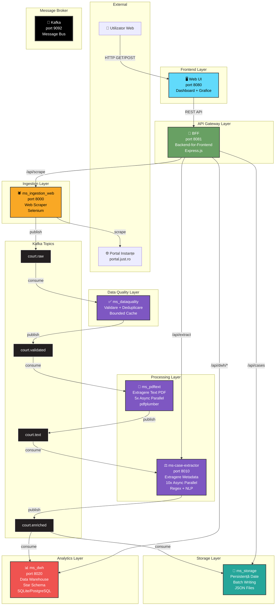
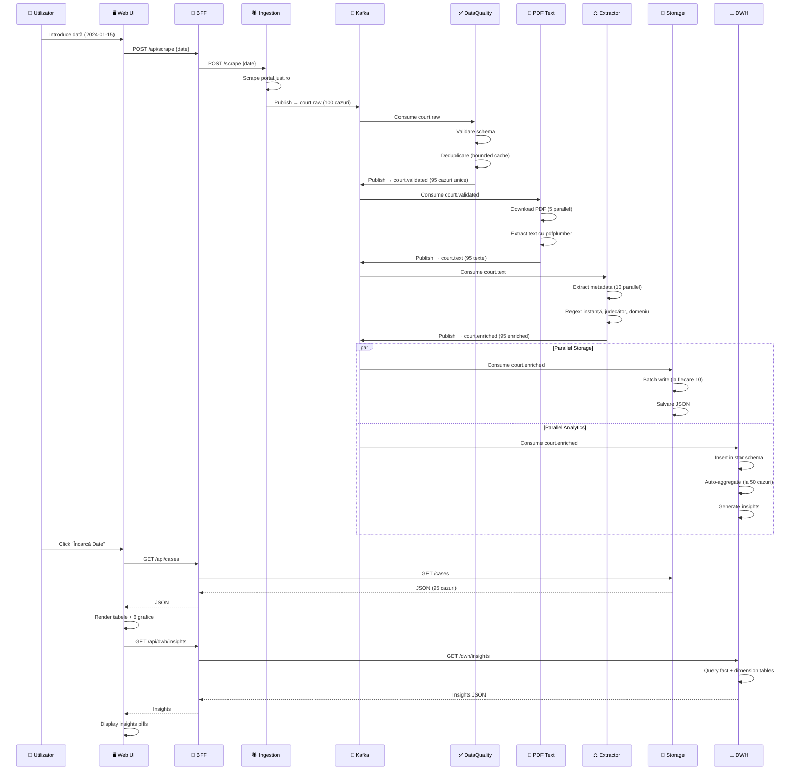
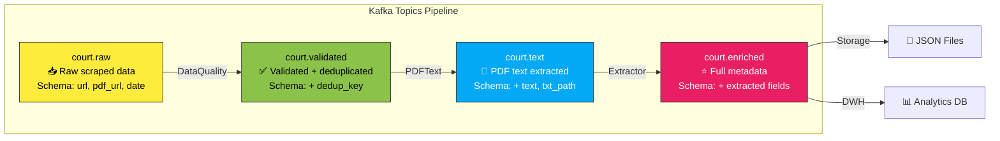
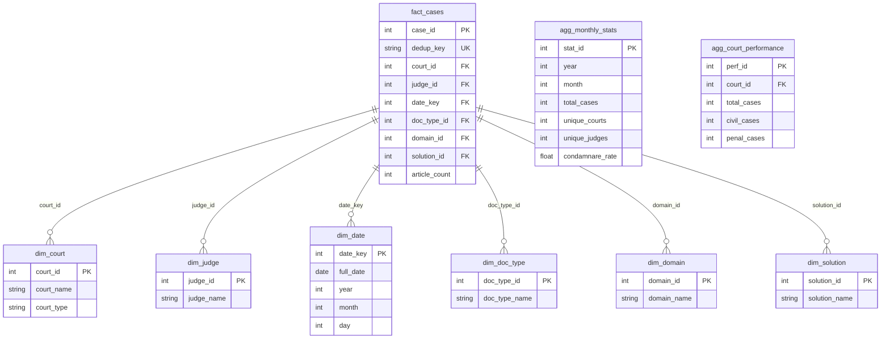
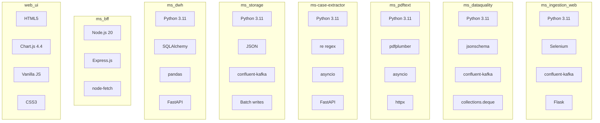
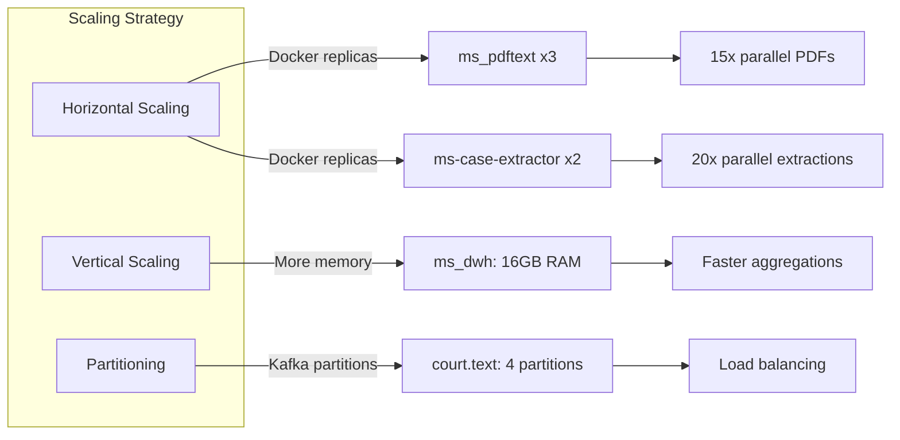

# Arhitectura Microserviciilor - Sistem Procesare Date Juridice

## Diagrama Arhitecturală Completă

## Fluxul Complet de Date

## Structura Kafka Topics

## Star Schema - Data Warehouse

## Porturile Serviciilor

| Microserviciu | Port | Protocol | Acces |
|---------------|------|----------|-------|
| **web_ui** | 8080 | HTTP | Public - UI utilizator |
| **ms_bff** | 8081 | HTTP | Public - API Gateway |
| **ms_ingestion_web** | 8000 | HTTP | Intern - Scraping API |
| **ms-case-extractor** | 8010 | HTTP | Intern - Extraction API |
| **ms_dwh** | 8020 | HTTP | Intern - Analytics API |
| **kafka** | 9092 | TCP | Intern - Message Broker |
| **zookeeper** | 2181 | TCP | Intern - Kafka coordination |

## Tech Stack pe Microserviciu

## Optimizări Implementate

| Layer | Optimizare | Impact | Configurare |
|-------|-----------|---------|-------------|
| **PDF Processing** | Async 5x parallel downloads | 5x mai rapid | `PDF_CONCURRENCY=5` |
| **Extraction** | Async 10x parallel processing | 10x mai rapid | `EXTRACT_CONCURRENCY=10` |
| **Storage** | Batch writing (10 msgs) | 90% mai puține I/O | `STORAGE_BATCH_SIZE=10` |
| **Kafka** | LZ4 compression + batching | 60% mai puțin bandwidth | `linger.ms=100` |
| **DWH** | Pre-aggregated tables | Query speed 100x | Auto-compute la 50 cazuri |
| **DataQuality** | Bounded cache (10k) | Memory safe | `MAX_DEDUP_SIZE=10000` |

## Performanță Globală

**Benchmark: Procesare 100 cazuri**

| Versiune | Timp Total | Throughput |
|----------|-----------|------------|
| Sincron (v1.0) | ~210 secunde | 0.48 cazuri/s |
| Async (v2.0) | ~40 secunde | 2.5 cazuri/s |
| **Îmbunătățire** | **5.25x mai rapid** | **5.2x throughput** |

## Scalabilitate

## Securitate & Producție

### Recomandări pentru Producție:

1. **Database**: SQLite → PostgreSQL cu connection pooling
2. **Message Broker**: Kafka replication factor = 3
3. **Authentication**: JWT tokens în BFF
4. **Rate Limiting**: 100 req/min per user în BFF
5. **Monitoring**: Prometheus + Grafana
6. **Logging**: ELK Stack (Elasticsearch, Logstash, Kibana)
7. **Secrets**: Vault sau AWS Secrets Manager
8. **TLS**: HTTPS pentru toate serviciile publice
9. **Backup**: Daily backups DWH + JSON storage
10. **CI/CD**: GitHub Actions cu automated testing

## Use Cases Business

### 1. Cercetare Juridică
- Găsește precedente similare după domeniu/instanță/judecător
- Analizează tendințe în legislație

### 2. Business Intelligence
- KPIs: rata de condamnare, durata medie procese
- Benchmarking între instanțe

### 3. Monitorizare Transparență
- Verifică activitatea judecătorilor
- Identifică anomalii în volumul de cazuri

### 4. Jurnalism Investigativ
- Corelează date din multiple surse
- Generează insights automate

## Roadmap Viitor

- [ ] GraphQL API în loc de REST
- [ ] Real-time WebSocket updates
- [ ] Machine Learning pentru predicții
- [ ] Elasticsearch pentru full-text search
- [ ] Export PDF/Excel din UI
- [ ] Multi-tenant support
- [ ] Mobile app (React Native)
- [ ] Advanced caching (Redis)
